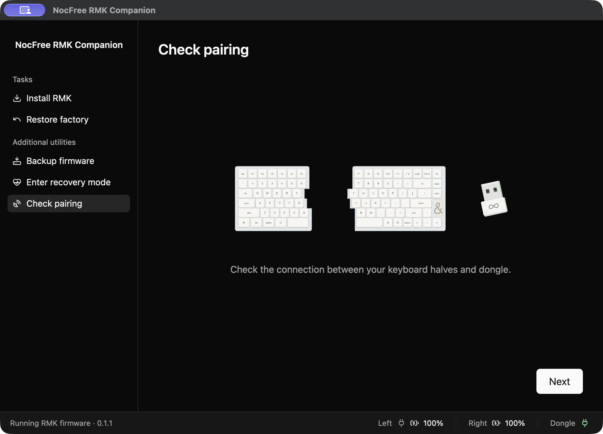

# NocFree RMK Companion

Install RMK on your NocFree AND keyboard.

Save the keyboard’s original software. Install RMK. Change keys. Check that both halves work. Return to the original software when you want.


## Download

| Computer | App |
| --- | --- |
| Mac with Apple Silicon | [Download for Mac](https://github.com/sarimabbas/nocfree-and-rmk/releases/download/v0.1.2/nocfree-rmk-companion-0.1.2-macos-arm64.zip) |
| Windows, 64-bit | [Download for Windows](https://github.com/sarimabbas/nocfree-and-rmk/releases/download/v0.1.2/nocfree-rmk-companion-0.1.2-windows-x86_64.zip) |
| Linux, 64-bit | [Download for Linux](https://github.com/sarimabbas/nocfree-and-rmk/releases/download/v0.1.2/nocfree-rmk-companion-0.1.2-linux-x86_64.tar.gz) |

Use the file for your computer. Mac uses a ZIP file. Open it, then move **NocFree RMK Companion** to **Applications**.

Windows: open the ZIP file, keep all its files together, then open **nocfree-companion.exe**. Linux: open the archive and follow the included **README.txt**.

On Mac, you can also use Homebrew:

```sh
brew install --cask sarimabbas/tap/nocfree-rmk-companion
```

This is an early release for the ANSI NocFree AND. The keyboard and app have been tested on Mac. Windows and Linux need more testing.

## Start here

1. Connect both keyboard halves and the dongle to your computer with USB.
2. Open Companion. Select **Backup firmware**. Keep the backup files.
3. Select **Install RMK**. Follow each screen. Click **Next** when you are ready.

Keep the USB cables connected until the app asks you to remove them.

## What works

| Feature | Support |
| --- | --- |
| Save the original keyboard software | Yes, each half and the dongle |
| Install RMK | Yes |
| Return to the original software | Yes, with your saved backup |
| Type with a USB cable | Yes |
| Type with Bluetooth | Yes |
| Type with the dongle | Yes, after RMK is installed on the dongle |
| Check both halves and all three connection modes | Yes, with guided typing tests |
| Change keys | Yes |
| Change the backlight brightness | Yes, with 16 levels |
| See each half’s battery level | Yes, as an estimate |
| Save logs for help | Yes, with an app screenshot when available |
| Other keyboard layouts or an extra number pad | Not tested |



The left switch selects the connection: **top = dongle**, **middle = USB**, **bottom = Bluetooth**. A USB cable can charge a half while it uses a wireless connection.

## Need help?

Open **Help → Export diagnostic logs**. Check the ZIP file and its screenshot before you share it. [Report a problem](https://github.com/sarimabbas/nocfree-and-rmk/issues/new/choose) and attach the ZIP file. Companion does not send it for you.

For code, builds, recovery details and known limits, see [TECHNICAL.md](TECHNICAL.md).

This is a community project. It is not made or supported by NocFree. Project code uses the [MIT license](LICENSE). Other included code keeps its own license.
