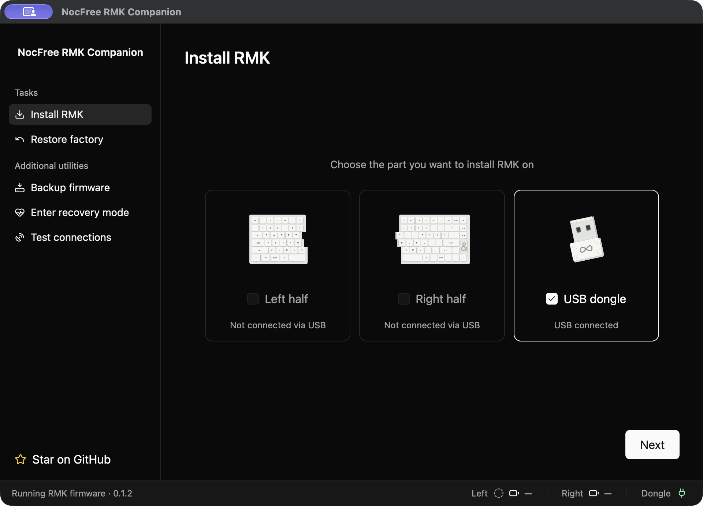

# NocFree RMK Companion

Install RMK on your NocFree AND keyboard with a [guided app](https://nocfree-rmk.lil.run/) for Mac, Windows and Linux. USB, Bluetooth and dongle supported.



## Download

| Computer | App |
| --- | --- |
| Mac with Apple Silicon | [Download for Mac](https://github.com/sarimabbas/nocfree-and-rmk/releases/latest/download/nocfree-rmk-companion-macos-arm64.zip) |
| Windows, 64-bit | [Download for Windows](https://github.com/sarimabbas/nocfree-and-rmk/releases/latest/download/nocfree-rmk-companion-windows-x86_64.zip) |
| Linux, 64-bit | [Download for Linux](https://github.com/sarimabbas/nocfree-and-rmk/releases/latest/download/nocfree-rmk-companion-linux-x86_64.tar.gz) |

On Mac, open the ZIP file and move **NocFree RMK Companion** to **Applications**.

On Windows, open the ZIP file, keep all its files together, then open **nocfree-companion.exe**. On Linux, open the archive and follow the included **README.txt**.

On Mac, you can also use Homebrew:

```sh
brew install --cask sarimabbas/tap/nocfree-rmk-companion
```

## Start here

1. Connect both keyboard halves and the dongle to your computer with USB.
2. Open Companion and select **Install RMK**.
3. Follow the instructions on each screen and click **Next** when you are ready.

Before it replaces the software on a part, Companion saves a backup automatically. Keep the USB cables connected until the app asks you to remove them.

To return to the original software, select **Restore factory** and follow the app instructions. Companion uses the factory backup saved during your first installation.

## Features

- [x] Install RMK and restore the original software from your backup
- [x] Install the included ANSI, ISO, JIS or KR layout
- [x] Type through USB, Bluetooth or the RMK dongle
- [x] Check both halves with guided typing tests
- [x] Change keys and create macros, combos and Tap Dance actions with Vial
- [x] Backlight brightness

## Use the keyboard

The left switch controls power. With USB unplugged, **top or bottom turns LEFT on** and **middle turns it off**. Turn RIGHT on to use both halves. Use the keys below to choose a connection; the switch position does not choose it.

Hold **Fn on LEFT** and tap the other key:

| Keys | Action |
| --- | --- |
| **Fn + Tab** | Use the dongle |
| **Fn + 1** through **Fn + 5** | Use a Bluetooth slot |
| **Fn + Space** | Switch between USB and wireless while LEFT USB is connected |

For Bluetooth, choose a slot, then connect **NocFree RMK** in your computer's Bluetooth settings. You can pair each slot with a different computer. To replace a slot's pairing, hold its **Fn + number** combination for five seconds, then connect again. To pair the dongle again, leave it plugged in and hold **LEFT Fn + Tab** for five seconds.

To type through USB, connect LEFT by USB. If typing still goes to Bluetooth or the dongle, tap **LEFT Fn + Space**. With USB unplugged, use **Fn + Tab** or **Fn + 1** through **Fn + 5** to choose your wireless connection.

Press **F5** to lower the backlight and **F6** to raise it. Each press changes the brightness by one step.

## Change keys

Connect LEFT by USB, unplug the dongle, and open [Vial](https://get.vial.today/). Select **NocFree RMK**, then select a key and its new action. The keyboard saves your changes for USB, Bluetooth and dongle typing. Keep a Fn key so you can use the connection controls above.

## Comparison to other firmware

These projects offer different ways to use the NocFree AND keyboard.

| Feature | RMK Companion | [Nocfree-and-ZMK-rust](https://github.com/jhkim0218/Nocfree-and-ZMK-rust) | [NocFree-and-zmk](https://github.com/NocFreeKB/NocFree-and-zmk) |
| --- | --- | --- | --- |
| Installation | Guided app for Mac, Windows and Linux | Download firmware and follow the recovery guide | Build firmware on GitHub or your computer, then install it |
| USB and Bluetooth typing | Yes | Yes | Yes |
| Dongle typing | Yes, with RMK dongle firmware | Yes, with Rust dongle firmware | Not included |
| Change keys | Vial | NocFree Link | Edit the keymap file and rebuild |
| Backlight brightness | 16 levels | Off and five brightness levels | Not included |
| Keyboard layouts | ANSI, ISO, JIS and KR in the app | ANSI and KR; ISO and JIS test builds | ANSI |

## Need help?

If you need help, use **Help → Export diagnostic logs** to save a ZIP file. Attach it to a [problem report](https://github.com/sarimabbas/nocfree-and-rmk/issues/new/choose).
